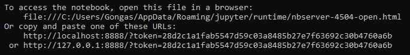

# EIACD Grupo D - Video Games

## Introdução
O **Klotski** trata-se de um jogo de quebra-cabeças que envolve mover uma ou mais peças num tabuleiro (5x4) de forma a alcançar um objetivo. Neste jogo, o objetivo é mover a peça vermelha ao longo do tabuleiro até alcançar a sua posição final. As peças podem apresentar tanto um formato como um tamanho variáveis, dispondo, assim, de  imensas configurações possíveis para o tabuleiro.
Por fim, este jogo dispõe de vários níveis de dificuldade de forma a estimular o jogador e simultaneamente proporcionar uma experiência mais desafiante.

## Pré-Requisitos
De forma a compilar e executar o programa são necessários vários pré-requiitos:
- Utilização da Plataforma Anaconda (Distribuição de Python e R)
- Instalação de múltiplas Livrarias: **[Pandas](https://pandas.pydata.org/pandas-docs/stable/getting_started/install.html)**, **[Numpy](https://numpy.org/install/)**, **[MatpltLib](https://matplotlib.org/stable/users/installing/index.html)**, **[Seaborn](https://seaborn.pydata.org/installing.html)** e **[Scikit-Learn](https://scikit-learn.org/stable/install.html)**

## Compilação e Execução
De forma a compilar e executar o ficheiro, será necessário aceder à Anaconda Prompt e executar o seguinte comando: 

 ```jupyter notebook```
 
 Após a execução deste comando deverá copiar o URL (exemplo abaixo) e colar num separador web:
 
<div align="center">
    
</div>

 Posteriormente, deverá aceder ao diretório em que o ficheiro está armazenado e, portantom, abri-lo.
 
Caso não funcione, verifique que possui todos os pré-requisitos mencionados **[anteriormente](#pré-requisitos)** e tente novamente. 
Por fim, se o problema persistir não hesite em **[contactar-nos](#considerações-finais)**.

## XXX


## Considerações Finais
Se existir alguma **dificuldade** no download ou execução do ficheiro não hesite em contactar-nos:
- **Via email**: 
    - Gonçalo Esteves: up202203947@up.pt 
    - Nuno Gomes: up202206195@up.pt
