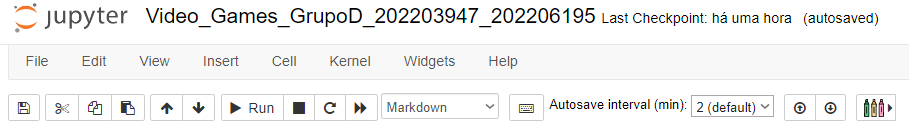

# EIACD Grupo D - Video Games

## Introdução
Atualmente, dada a elevada **competitividade** na indústria dos **jogos eletrónicos**, torna-se importante, para uma empresa, **prever** o sucesso adjacente ao lançamento do seu produto no mercado. Um dos principais aspetos a ter em conta nesta previsão são as **reviews dos consumidores**. Deste modo, obtém-se o seguinte **problema de classificação**: 

```Qual o user_rating do vídeo jogo?```

De forma a resolvê-lo, foi-nos fornecido um **dataset** com dados de cerca de 6000 video jogos. Partindo destes, foi-nos possível realizar tanto a sua **análise exploratória** como a respetiva **feature engineering**. 

Por fim, após esta manipulação e tratamento de dados, apenas resta criar um **modelo preditivo** capaz de classificar qualquer vídeo jogo e avaliar a sua **performance**.


## Pré-Requisitos
De forma a compilar e executar o programa são necessários vários pré-requiitos:
- Utilização da Plataforma Anaconda (Distribuição de Python e R)
- Instalação de múltiplas Livrarias: **[Pandas](https://pandas.pydata.org/pandas-docs/stable/getting_started/install.html)**, **[Numpy](https://numpy.org/install/)**, **[MatpltLib](https://matplotlib.org/stable/users/installing/index.html)**, **[Seaborn](https://seaborn.pydata.org/installing.html)** e **[Scikit-Learn](https://scikit-learn.org/stable/install.html)**

## Compilação e Execução
De forma a compilar e executar o ficheiro, será necessário aceder à Anaconda Prompt e executar o comando: 

 ```jupyter notebook```
 
Após a execução deste comando deverá copiar o **URL** (exemplo abaixo) e colar num separador web:
 
<div align="center">
    
</div>

Desta forma, terá de aceder ao **diretório** onde o **ficheiro** está armazenado. Neste, deve selecioná-lo de forma abri-lo.

De seguida de forma a executar as várias **células** presentes no documento, poderá executar ```Shift + Enter``` com o intuito de corrê-las de **forma sequencial**. Analogamente, poderá recorrer aos múltiplos botões presentes na interface gráfica do **jupyter notebook** dado proporcionarem uma panóplia de ações sobre a manipulação do **fluxo de execução do programa**.

<div align="center">
    
</div>

Caso esteja com **dificuldades**, verifique que possui todos os pré-requisitos mencionados **[anteriormente](#pré-requisitos)** e tente novamente. 
Por fim, se o problema persistir não hesite em **[contactar-nos](#considerações-finais)**.

## XXX

## Considerações Finais
Se existir alguma **dificuldade** no download ou execução do ficheiro não hesite em contactar-nos:
- **Via email**: 
    - Gonçalo Esteves: up202203947@up.pt 
    - Nuno Gomes: up202206195@up.pt
